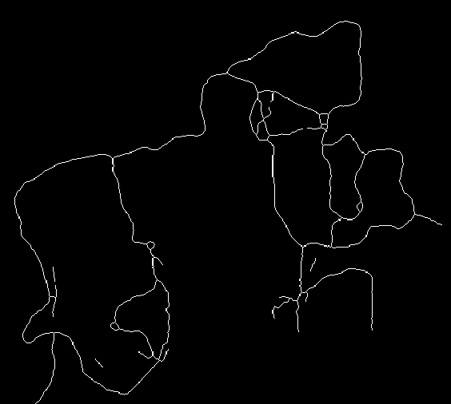

# line-drawing-to-svg

---

This MATLAB library provides functionality for 1:1 conversion of line drawings into SVG files. The purpose is for lossless conversion of raster line drawings into vectorized line drawings. The converted files will be identical to the original files and infinitely zoomable. The SVG output is structured using a separate polyline between each joint.

[](https://www.mathworks.com/matlabcentral/fileexchange/78309-lossless-line-drawing-to-svg-conversion)

---

## Table of Contents

- [Example](#Example)
- [Dependencies](#Dependencies)
- [FAQ](#FAQ)
- [Related Projects](#Related_Projects)

---

## Example
Read in a raster line drawing, `exLarge.png`

```MATLAB
im = imread('exLarge.png');
```

Run the function `vectorizeLineSmart.m` on the image to get coordinate lists

```MATLAB
svgData = vectorizeLineSmart(im);
```

Run the function `printSVGpoly.m` to print the data to an SVG file

```MATLAB
printSVGpoly(svgData, im, 'output.svg');
```

PNG (Original) | SVG (Converted)
:---: | :---:
 |  

---

## Dependencies
[Image Processing Toolbox](https://www.mathworks.com/products/image.html)

---

## FAQ

- **Why is this better than other alternatives?**

  - After trying many solutions online, you will find that none are 1:1 conversions. Online solutions are designed around graphic design where a line may be larger than 1 pixel. They use machine learning to quickly convert raster to vector at the cost of some features.

  - This library is optimized for use on 1 pixel wide line drawings. These files might be the result of a skeletonization. Converting the file using this library will 100% preserve the image.

- **How fast are the functions?**

  - On the example, the `exLarge.png` file which is 506x564 pixels and has 3403 edge pixels takes approximately 0.2 seconds to run the `vectorizeLineSmart.m` function. The runtime will be roughly proportional to the dimensions*numPixels. The library is currently single-threaded.
 
  - Alternatively, the `vectorizeLineDense.m` function can be used which will return the same image, but every pixel will have a connection to adjacent pixels. This will take approximately half the time, 0.1 seconds. Attempting to open the image in a renderer will take more time.

- **How is a 1:1 conversion achieved?**

  - The `vectorizeLineSmart.m` function looks at any endpoints or joints in the line drawing. It traces a line from these points until it reaches another endpoint or joint. This process is repeated until all connections have been created.

  - Using the `svgDataIntermediate` variable with `printSVGpoly.m` will create a image composed of polylines between the joints. Using the `svgDataSimple` variable with `printSVG.m` will create an image composed of straight line segments in 8-connectivity space. Using the `svgDataDense` variable with `printSVG.m` will create an image composed of pixel connections.

---

## Related_Projects
https://github.com/karsonkevin2/heatmap-skeletonization

---
